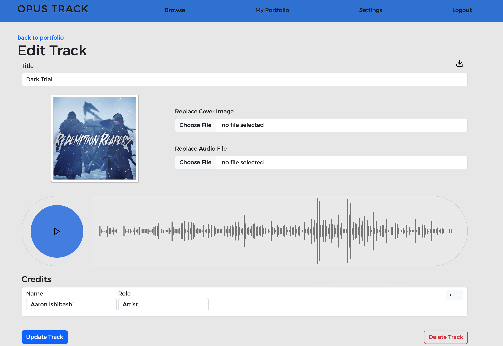
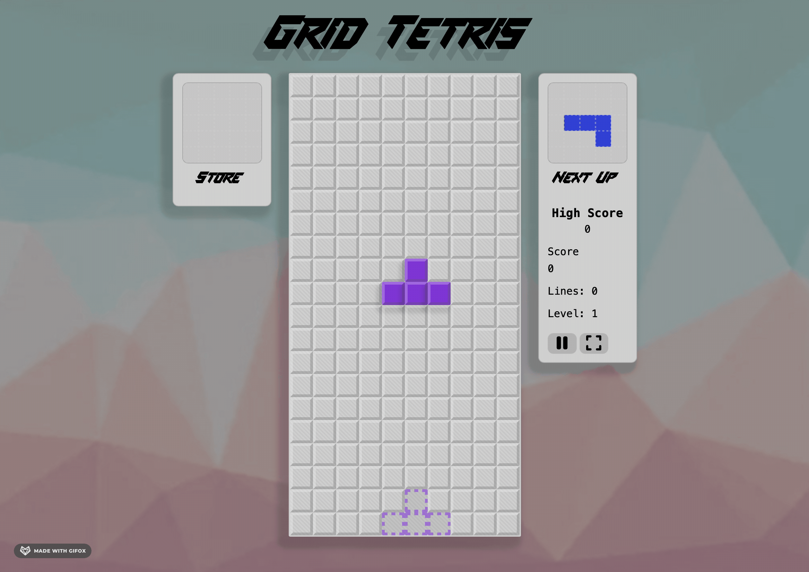
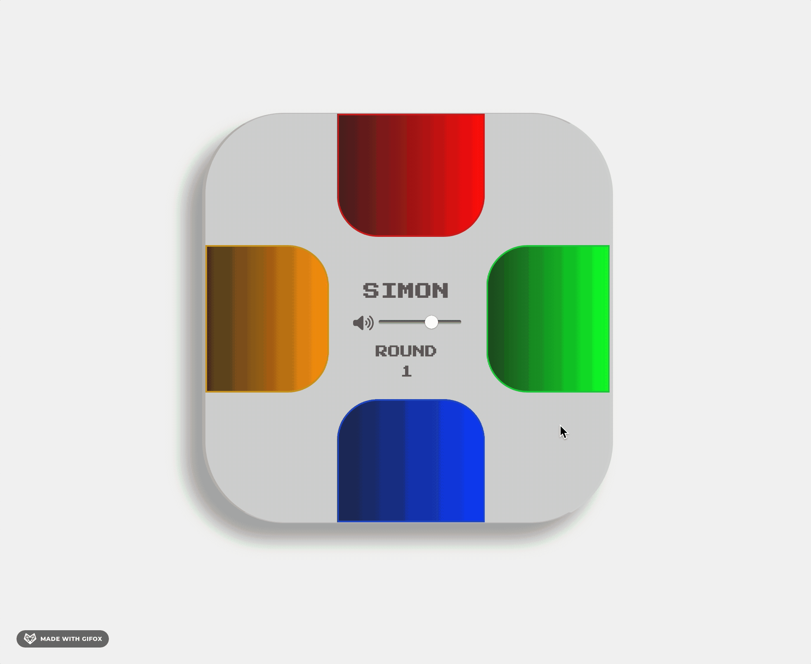

## About Me

Hello! I'm a software developer who loves understanding how to build things from the ground up. 

I get inspired by using well-designed frameworks, interfaces, and implementations, and am constantly learning to better refine my own code. 

As a former game composer, I aim to synthesize my passion for music and game technology with computer science and programming. I've found that crafting music and software both have much in common!

 

## Languages & Tools
  

 

 

## 🔭 I’m currently working on

### [Brokeman's Game Station](https://github.com/tadashibashi/brokemans-gamestation)

*An HTML5 game hosting and social site*

### [Opus Track](https://github.com/tadashibashi/opus-track)

*Music client collaboration platform*

## :video_game: A couple games I made

### [Tetris](https://github.com/tadashibashi/tetris)
 

### [Simon](https://github.com/tadashibashi/simon)

