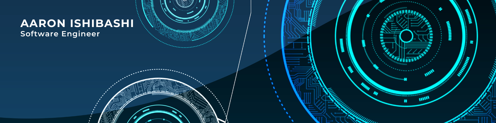

Hello! I'm a developer and classically-trained composer who enjoys learning how things work and building them from the ground up.
I grew up playing video game series like Mega Man Battle Network, Final Fantasy, Fire Emblem, 
and Mario, which sparked a passion in me for both music composition and game development.

In both music and software, I find some parallel goals:
1. seek an economy of means
2. seek technical clarity, originality, and creativity
3. repetition and practice

Right now, I am trying to understand cross-platform development in graphics and audio. 
To that end, here are some projects I'm currently working on.

## Current Projects

### [Insound Audio](https://github.com/tadashibashi/insound)

Low-level audio engine built with SDL_Audio

- PCM file loading and playback
- DSP plugin system
- Audio mix graph with nested busses and audio sources
- Minimal dependencies: SDL2 is privately statically linked

### [SDGL](https://github.com/tadashibashi/sdgl)

Low-level game library built on SDL2, OpenGL ES3 & ANGLE

Examples can be found [here](https://github.com/tadashibashi/sdgl-examples)

- 2D graphics rendering and batching, orthographic camera transformations
- Minimal dependencies: SDL2, spdlog, imgui, glm, stb

## Summary

  

Overall, using my practical experience as a game composer, I aim to synthesize my passion for music and game technology with software development. 
I've found that crafting music and software both have much in common!
